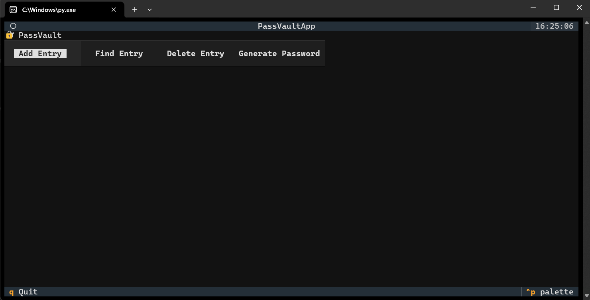

<h1 align="center">🔐 PassVault</h1>
<p align="center">
  <em>Шифрованный менеджер паролей на Python. Безопасно храните, находите, удаляйте и генерируйте пароли. Версия: 1</em>
</p>

  


🌍 **Язык:** RU  
🔑 **Шифрованное хранение паролей**  
📄 **Несколько паролей для одного сервиса**  
💡 **Простая генерация паролей**  
🛡️ **Безопасное локальное хранение**

---

## 📸 Скриншоты

### Основной интерфейс


---

## 🔧 Возможности

- ✅ Хранение нескольких паролей для одного сервиса  
- ✅ Поиск и удаление записей  
- ✅ Автоматическая генерация надёжных паролей  
- ✅ Локальное шифрование с использованием Fernet  
- ✅ Простой терминальный интерфейс, веб-сервер не требуется  

---

## 📦 Установка

```bash
# 1. Клонируйте репозиторий
git clone https://github.com/vazor-code/PassVault.git  
cd PassVault

# 2. Установите зависимости
pip install -r requirements.txt

# 3. Запустите приложение
python PassVault.py
```

> При первом запуске автоматически создаются файлы `key.key` и `vault.json`.  
> Эти файлы исключены из загрузки в GitHub через `.gitignore`.

---

## 📬 Обратная связь

Нашли баг или хотите новую функцию?  
👉 [Создайте issue](https://github.com/vazor/PassVault/issues)

💡 Хотите помочь в разработке? Сделайте форк репозитория и отправьте pull request.

---

<p align="center">
  Создано с ❤️ пользователем vazor  
  2025 · Лицензия MIT
</p>
